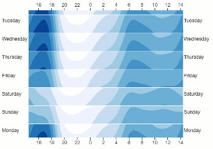

# WrappingChart

```
npm install
npm build
```
then open ```index.html``` in your browser for examples.

## Using in a web page:
Just consume the script, and create a div with a unique id somewhere in your page:
```
<script src="wrapchart.js"></script>
<div id="ChartDiv"></div>
```
Then call the ```chart``` function to populate the div with a wrap chart constructed from the specified images:
```
<script>
    chart("ChartDiv",
        "wrappablenswtraffic.png",
        "wrappablenswtraffic-xaxis-top.png",
        "wrappablenswtraffic-xaxis.png",
        "wrappablenswtraffic-yaxis.png",
        "wrappablenswtraffic-yaxis.png")
</script>
```
Where the images will be used for the body of the chart and the axes labels on each side, as follows:
```
function chart(
    targetElementSelector:string,
    bodyImageURL: string,
    xAxisTopImageURL: string|null,
    xAxisBottomImageURL: string|null,
    yAxisLeftImageURL: string|null,
    yAxisRightImageURL: string|null) 
```
It assumes that axes images are sized correctly for the body image, i.e. that x Axes are the same width as the body, and that y-axes are the same height as the body.

Note that you can specify ```null``` instead of an image for any of the axes labels and they will simply be omitted from the chart.
